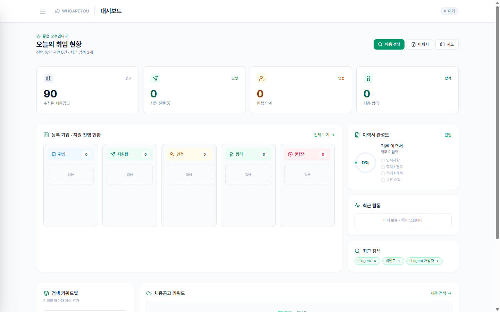
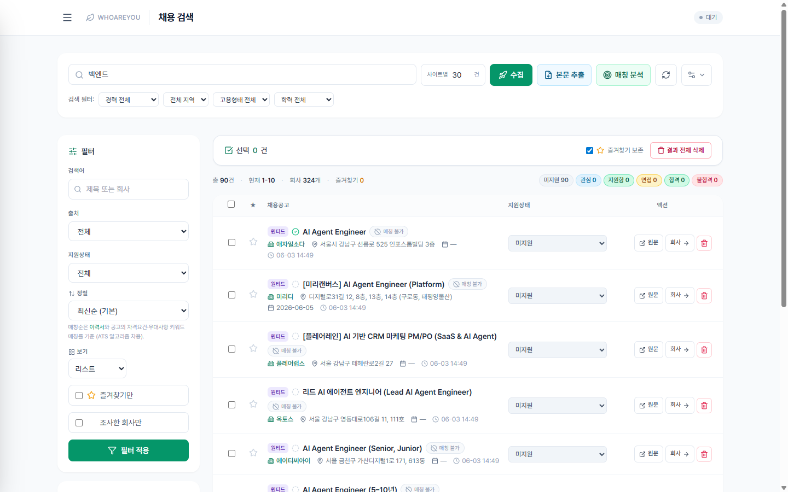
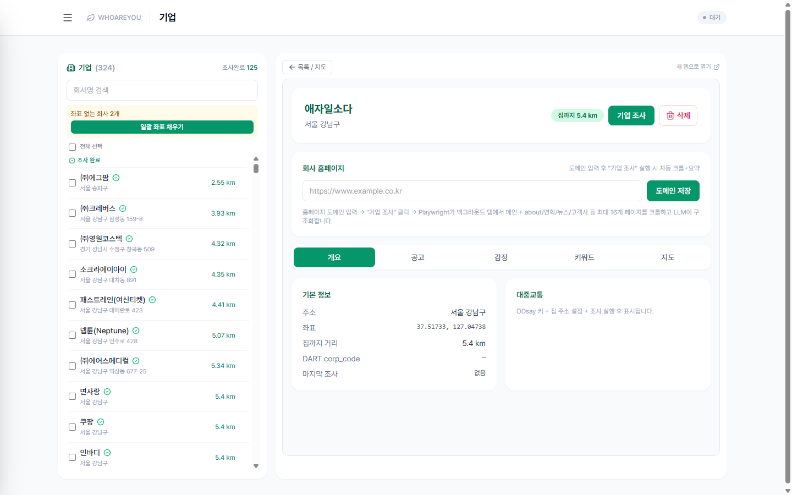
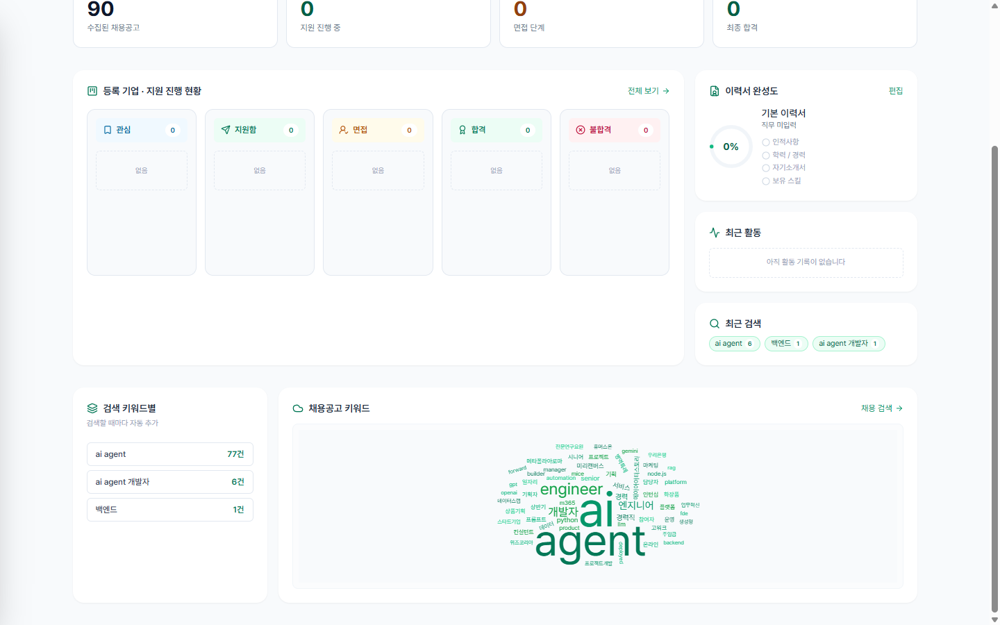
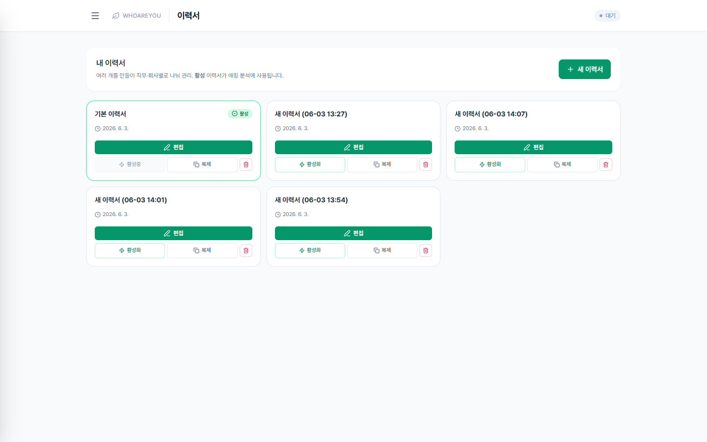
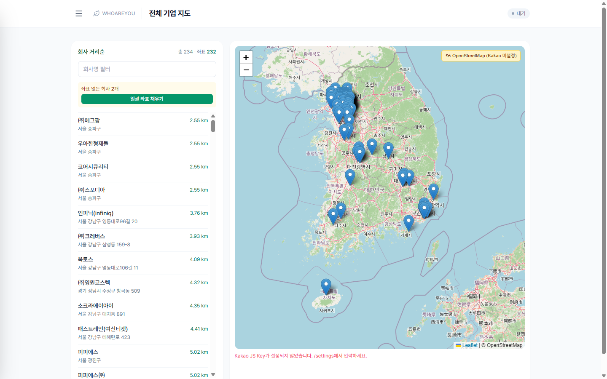
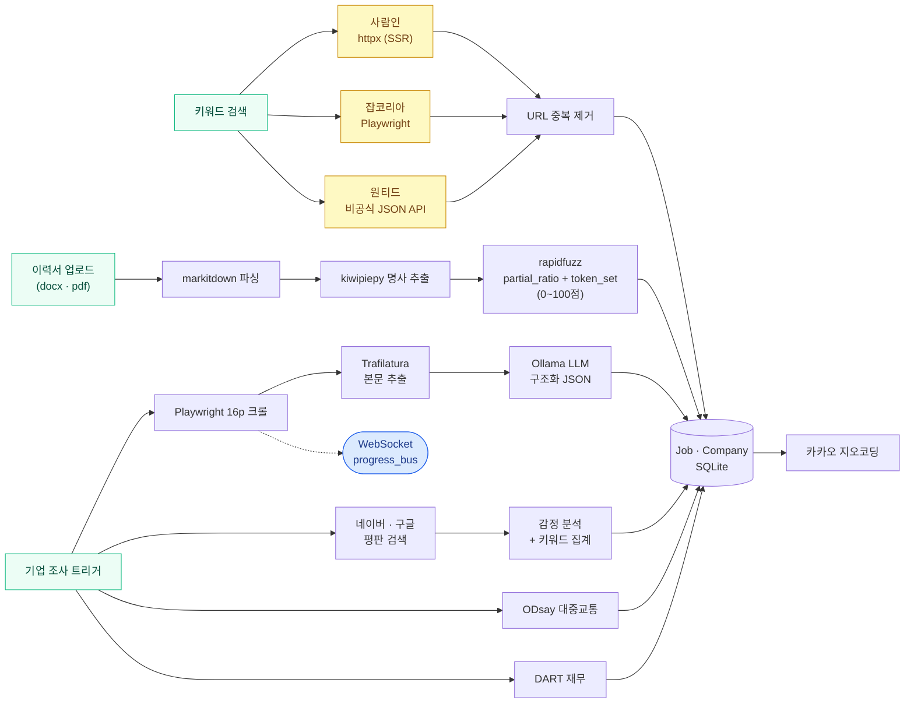

<div align="center">


### 🌿 취업 준비, 한 곳에서 끝내는 올인원 플랫폼

채용 공고 통합 검색부터 **이력서 ATS 매칭**, **AI 기업 조사**, **평판 감정 분석**, **통근 거리 계산**까지 —
흩어져 있던 취업 준비 과정을 하나의 로컬 서버로 묶었습니다.
**100% 로컬** — LLM은 Ollama, DB는 SQLite. 내 데이터는 내 PC에만 남습니다.

<br/>


</div>

---

## 주요 기능

- **통합 채용 검색** — 사람인 · 잡코리아 · 원티드 3개 사이트를 키워드 하나로 동시 수집하고 URL 기준 중복 제거.
  - 사이트별로 **다른 우회 전략을 자동 선택**합니다: **사람인** = `httpx`(서버 SSR이라 정적 파싱 충분 · 가장 빠름), **잡코리아** = `Playwright`(봇 차단 강해 풀 브라우저 우회 필요), **원티드** = 비공식 `JSON API`(공고 JSON 직접 호출, rate-limit 주의).
- **이력서 ATS 매칭** — 한국 채용 ATS(그리팅 · 나인하이어 등)의 평가 로직을 역설계해 LLM 없이 ms 단위로 점수 산출.
  - **추출**: `kiwipiepy`로 이력서·공고 자격요건·우대사항에서 한국어 명사만 뽑기 → **정규화**: 소문자·동의어 (`백엔드 ≈ Backend ≈ 서버 개발`) → **매칭**: `rapidfuzz`의 `partial_ratio + token_set_ratio` 가중 평균 → 임계값 이상만 hit → 가중 합산 → 0~100점.
- **AI 기업 조사** — 회사 홈페이지를 Playwright로 BFS 크롤(최대 16p: 메인·소개·연혁·뉴스·고객사·채용·이용약관) → `Trafilatura` + `readability-lxml`로 본문 추출 → `Ollama` LLM이 사업 도메인·핵심 기술·고객사·인재상을 구조화 JSON으로 요약.
- **평판 감정 분석** — 네이버(직장인 후기·카페·지식iN)와 구글(보도자료·투자·B2B 협력)을 동시 검색해 스니펫 수집 → LLM이 긍/부/중립으로 분류 → 키워드 빈도 → 워드클라우드 + 시간순 트렌드.
- **맞춤 자소서 생성** — 내 이력서 · 기업 조사 · 공고 본문 · ATS 매칭 키워드를 컨텍스트로 묶어서 지원동기·자기소개서를 생성.
  - **환각 차단**: 사실 추출 단계에서 "이력서에서 직접 인용한 문장만 사용" 강제 + 생성 후 추출된 사실로 역검증해 일치하지 않으면 재생성.
- **위치 · 통근 분석** — 카카오 지오코딩으로 회사 좌표 변환 → 집과의 **직선거리(Haversine)** + **ODsay 대중교통 경로**(소요시간·환승·비용·도보 거리) 계산. 출퇴근 가능 회사만 빠르게 필터링.
- **재무 · 공시** — DART API로 매출·영업이익·자본 등 최근 3년 추이 + 최근 공시 5건 (corp_code 매칭 시).
- **실시간 진행도** — 크롤·조사 진행률을 WebSocket으로 푸시. 클라이언트는 `progress_bus` SSE 채널을 구독해 페이지별 진행 단계(예: `crawling 7/16`, `llm_summary 1/3`)를 라이브로 표시.

---

## 🖼️ 미리보기

| 대시보드 — 90건 수집·이력서 완성도·최근 검색 키워드 | 채용 검색 — 3사 통합 90건 + 본문 추출·매칭 분석 트리거 |
|:---:|:---:|
|  |  |
| **기업 상세 — 324개사 사이드바·집까지 거리·5탭(개요/공고/감정/키워드/지도)** | **채용공고 키워드 워드클라우드 — 590+ 키워드 빈도** |
|  |  |
| **이력서 카드 그리드 — 직무·회사별 다중 이력서 + 활성 표시** | **전체 기업 지도 + 집과의 거리순 정렬** |
|  |  |

---

## 🚀 빠른 시작

```bash
# 1) 의존성 설치 (uv)
uv sync
uv run playwright install chromium

# 2) Ollama 모델 준비
ollama pull qwen3.5:9b          # 텍스트 LLM (기업 조사 · 감정 분석 · 자소서)
ollama pull qwen2.5vl:7b        # 비전 fallback (옵션 — 크롤 실패 페이지 OCR)

# 3) 실행
uv run python serve.py          # http://127.0.0.1:8000
```

> 💡 엔트리포인트는 `serve.py`입니다. Windows에서 `uvicorn`을 직접 띄우면 이벤트 루프가 `Selector`로 강제 전환돼 Playwright 서브프로세스가 죽습니다. `serve.py`가 `Proactor` 정책을 강제해 이 문제를 해결합니다.

### 첫 설정 (`/settings`)

| 키 | 발급처 | 용도 | 필수 |
|---|---|---|:---:|
| **카카오 REST / JS Key** | [developers.kakao.com](https://developers.kakao.com) | 회사 좌표 변환, 지도 표시 | ✅ |
| **집 주소** | — | 자동 좌표 변환 → 회사까지 거리 계산 | ✅ |
| **ODsay Key** | [lab.odsay.com](https://lab.odsay.com) | 대중교통 경로 · 시간 · 비용 | ⬜ |
| **DART API Key** | [opendart.fss.or.kr](https://opendart.fss.or.kr) | 재무/공시 요약 | ⬜ |
| **Ollama 모델명** | — | 기본 `qwen3.5:9b` / `qwen2.5vl:7b` | ⬜ |

---

## 🧭 페이지

| URL | 용도 |
|---|---|
| `/` | 대시보드 — 지원 현황 칸반 + 이력서 완성도 + 채용 키워드 워드클라우드 |
| `/jobs` | 채용 검색 — 3사 통합 수집 + ATS 매칭 점수 + 필터 검색 |
| `/job/{id}` | 공고 상세 — 본문(JD) + 매칭 키워드 분석 |
| `/resumes` | 이력서 목록 — 다중 이력서 카드 그리드 |
| `/resume` | 이력서 편집 — 업로드(docx/pdf) · 파싱 · 공고 매칭 |
| `/company/{id}` | 회사 상세 — 개요 · 공고 · 감정 · 키워드 · 지도 5탭 + 조사 트리거 |
| `/map` | 전체 회사 지도 + 집과의 거리순 리스트 |
| `/settings` | API 키 · 모델 · 집 주소 |

---

## 🔄 데이터 흐름



### 사이트별 우회 전략 (왜 다른 방식을 쓰나)

| 사이트 | 방식 | 이유 |
|---|---|---|
| **사람인** | `httpx` 정적 GET + BeautifulSoup | 서버 SSR이라 HTML이 바로 잡힘 · 가장 빠르고 안정적 |
| **잡코리아** | `Playwright` 풀 브라우저 | 봇 차단(JS 챌린지·쿠키·UA 체크) 강해 헤드리스 브라우저 필요 |
| **원티드** | 비공식 `/api/v4/jobs` JSON | 공식 SPA + 비공식 API 둘 다 있음. JSON이 가장 빠르고 깔끔하지만 rate-limit 보수적 |

### ATS 매칭 점수 산식 (LLM 없이 ms 단위)

```text
이력서 ────► kiwipiepy 명사 ────┐
                                ├──► rapidfuzz 가중 매칭 ──► hit / miss
공고 자격요건·우대 ─► 명사 ─────┘            (0.6 partial_ratio + 0.4 token_set)

점수 = Σ(hit 명사 가중치) / Σ(전체 명사 가중치) × 100
가중치: 자격요건 1.0 · 우대사항 0.6 · 본문 키워드 0.3
```

---

## 🛠 기술 스택

| 영역 | 사용 기술 |
|---|---|
| **백엔드** | FastAPI · SQLModel · aiosqlite · Pydantic Settings · uv |
| **크롤링** | Playwright · httpx · Trafilatura · readability-lxml · markitdown |
| **AI / NLP** | Ollama (qwen3.5) · kiwipiepy · rapidfuzz |
| **프론트엔드** | Jinja2 · Tailwind CSS · HTMX · Alpine.js · SweetAlert2 · Lucide |
| **외부 API** | 카카오(지오코딩 · 지도) · ODsay(대중교통) · DART(공시) |
| **비동기 큐** | asyncio in-memory (기본) · Arq + Redis (옵션) |

---

## 📁 디렉토리 구조

```text
app/
├── main.py · config.py · db.py · deps.py · models.py
├── routes/      pages · api_jobs · api_companies · api_dashboard · api_resume · api_ollama · ws_progress
├── crawler/     browser · strategies · extractor · llm · vision_fallback · jd_fetcher · pipeline
│   └── adapters/  saramin(httpx) · jobkorea(Playwright) · wanted(JSON API)
├── analysis/    ats(매칭) · resume_text · document(파싱) · cover_letter(자소서) · keywords · emotion · categories
├── companies/   pipeline · research · discover · geocode · dart · sentiment · community(네이버·구글) · playwright_research
├── geo/         kakao · odsay · distance(Haversine)
├── ui/          progress_bus · settings_store · api_status
└── workers/     arq_settings · tasks (Redis 활성 시)

templates/
└── base.html(녹색 Tailwind/HTMX/Alpine) · index · jobs · job_detail · resume(s) · company(5탭) · map · settings
```

---

## ⚠️ 알려진 사항

- **Windows 콘솔** — 기본 CP949라 한국어 `print`가 깨져 보입니다. 데이터는 UTF-8로 정상 저장됩니다. 콘솔도 정상으로 보려면 `chcp 65001` + `PYTHONUTF8=1`.
- **Redis 미사용** — 기본은 in-memory asyncio 진행도 버스로 동작. Redis를 띄우면 `app/workers/arq_settings.py`로 워커를 분리할 수 있습니다.
- **원티드 rate-limit** — 잦은 호출 시 일시적으로 빈 응답이 옵니다. 재시도하면 복구됩니다.
- **평판 검색** — 네이버 · 구글 검색 결과를 동적 렌더링으로 긁기 때문에, 노출이 적은 회사는 스니펫이 적게 수집될 수 있습니다. 

<div align="center">


</div>
