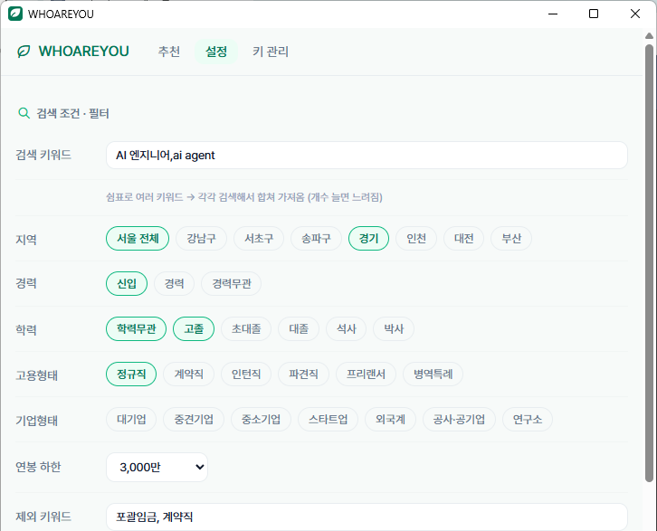
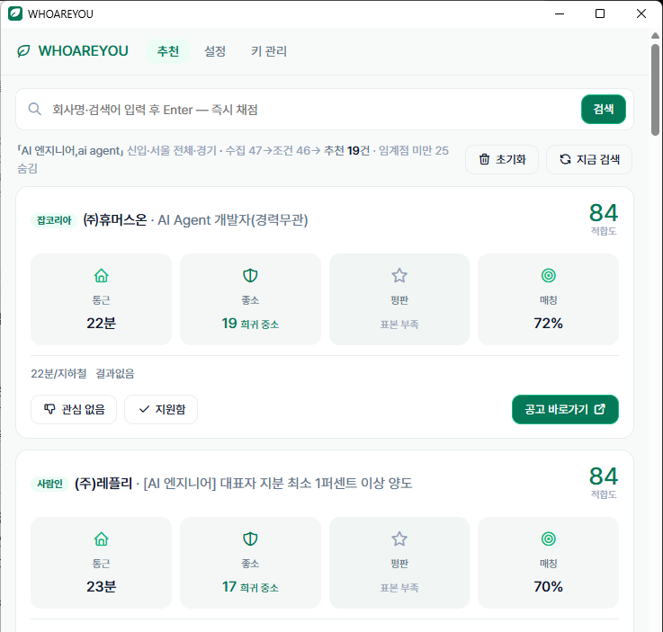
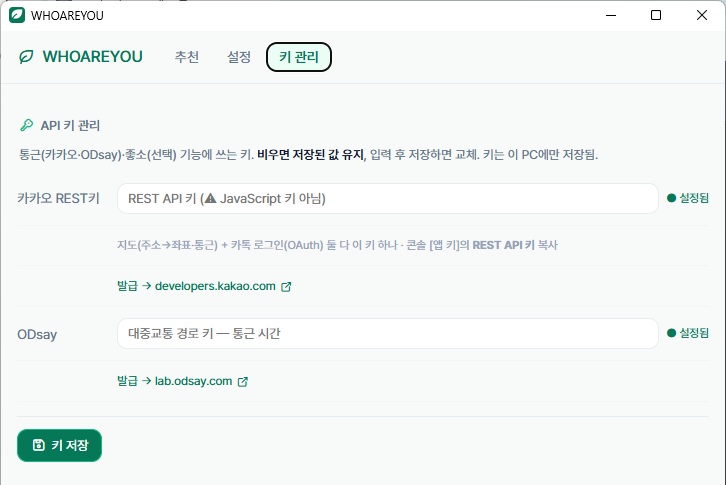
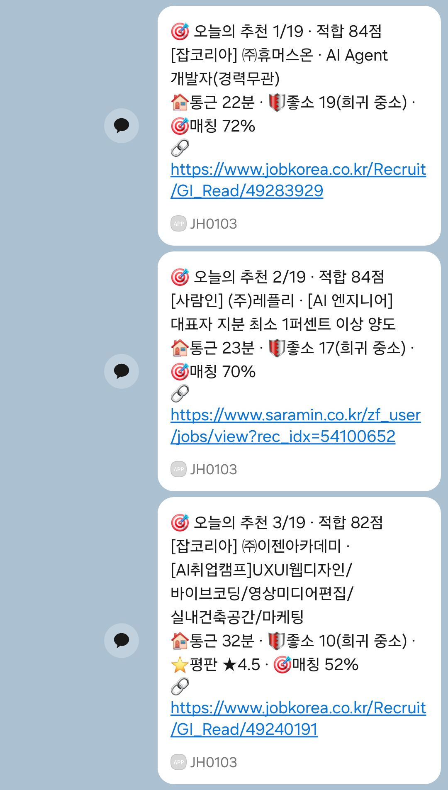
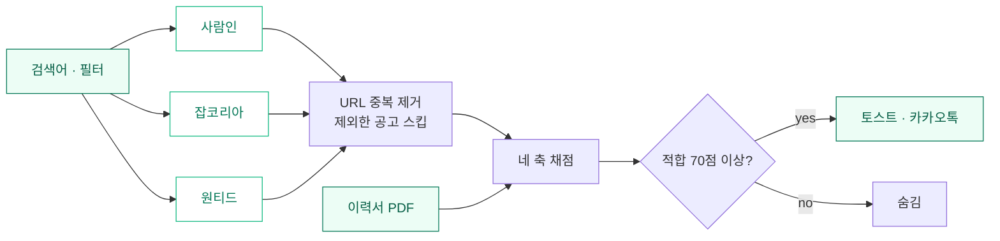

<div align="center">


### 🌿 알아서 찾아주는 취업 매칭 에이전트

트레이에 상주하면서 사람인·잡코리아·원티드의 새 공고를 모으고,
통근·좋소·평판·이력서 매칭 네 축으로 점수를 매겨 잘 맞는 곳만 추려 알려줍니다.
**100% 로컬** — 이력서도 API 키도 PC 밖으로 나가지 않습니다.

<br/>


</div>

---

## 🖼️ 미리보기 — 설치 없이 30초면 파악됩니다

조건을 한 번 넣어두면 트레이에서 주기적으로 수집·채점하고, 임계점을 넘는 공고만 토스트·카카오톡으로 알려줍니다. 설치하지 않아도 아래 화면만 보면 어떻게 도는지 다 보입니다.

| ① 설정 — 검색어·필터·가중치 | ② 추천 — 통근·좋소·평판·매칭 네 축 채점 |
|:---:|:---:|
|  |  |
| **③ 알림 — 임계점 넘으면 토스트** | **키 관리 — 카카오·ODsay, 내 PC에만 저장** |
|  |  |

---

## 📩 카카오톡 알림

잘 맞는 공고가 나오면 카카오톡 나에게 보내기로 보냅니다 — 출처·네 축·공고 링크까지 한 번에.

<div align="center">

</div>

---

## 주요 기능

- **알아서 수집** — 설정한 주기마다 사람인·잡코리아·원티드에서 필터에 맞는 새 공고를 모읍니다. 검색어를 여러 개 걸 수 있고, 지역·경력·학력·고용형태는 소스에서 바로 걸러 가져옵니다.
- **네 축 채점** — 통근(카카오+ODsay)·좋소(국민연금 기반 jotso)·평판(잡플래닛 별점)·이력서 매칭을 가중치로 합산합니다. 표본이 없는 축은 0점 대신 판단 보류로 빼고 다시 정규화합니다.
- **이력서 매칭** — 어휘·스킬 사전에 bge-reranker 크로스인코더를 더해 이력서와 공고의 실제 적합도를 계산합니다. 회사 이름이 아니라 내가 할 수 있는 일로 맞춥니다.
- **트레이 상주 + 알림** — 백그라운드로 돌다가 잘 맞는 공고가 나오면 Windows 토스트와 카카오톡 나에게 보내기로 링크까지 보냅니다.
- **정직한 신호** — 크롤·별점·통근이 조용히 실패하면 결과 없음으로 표시합니다. 근거가 없으면 판단을 보류합니다.

---

## ⚙️ 네 축 채점

| 축 | 가중치 | 출처 |
|---|:---:|---|
| 🏠 통근 | 25 | 카카오 지오코딩 + ODsay 대중교통 |
| 🛡 좋소 | 25 | 국민연금 기반 회전율·연봉 (jotso) |
| ⭐ 평판 | 20 | 잡플래닛 별점 |
| 🎯 매칭 | 30 | 이력서 ↔ 공고 (어휘 + 리랭커) |

---

## 🔄 동작 흐름



---

## 🚀 실행

**설치형(권장)** — [Releases](https://github.com/kimkuhyun/WHOAREYOU/releases)의 `WHOAREYOU_setup.exe` 하나면 됩니다. 설치 중 라이브러리와 AI 모델(리랭커·OCR)을 자동으로 받아 구성해서, 별도 Python 없이 바로 완전한 기능으로 돌아갑니다. (최초 1회 약 3GB·인터넷 필요)

> 🛡️ 처음 실행하면 Windows SmartScreen이 "Windows의 PC 보호" 파란 창을 띄웁니다. 개인 개발자라 코드서명 인증서가 없어서 뜨는 경고입니다 — **[추가 정보] → [실행]**을 누르면 됩니다.

```bash
# 개발 실행
uv sync
.venv\Scripts\python run.py

# 설치형 빌드 (원클릭 인스톨러 — 리랭커·OCR 포함)
ISCC setup.iss   # 루트에 uv.exe 배치 후 → Output\WHOAREYOU_setup.exe
```

첫 실행 뒤 **키 관리** 탭에 카카오 REST 키를, **설정** 탭에 이력서와 집 주소를 넣으면 끝입니다.

| 키 | 발급처 | 용도 |
|---|---|---|
| 카카오 REST | developers.kakao.com | 회사 좌표·통근 + 카톡 알림 |
| ODsay | lab.odsay.com | 대중교통 경로 (선택) |

---

## 🔒 원칙

- **로컬 우선** — 이력서·지원 현황·API 키는 이 PC에만 둡니다.
- **결정론** — 점수는 규칙과 사전, 리랭커로만 냅니다. 채팅 LLM은 쓰지 않습니다.
- **정직** — 근거가 없으면 판단을 보류하고, 실패를 조용히 넘기지 않습니다.

<div align="center">
<br/>
<sub>🌿 흩어진 채용 사이트를 한자리에 — 마음에 드는 곳에 지원만 하면 됩니다.</sub>
</div>
